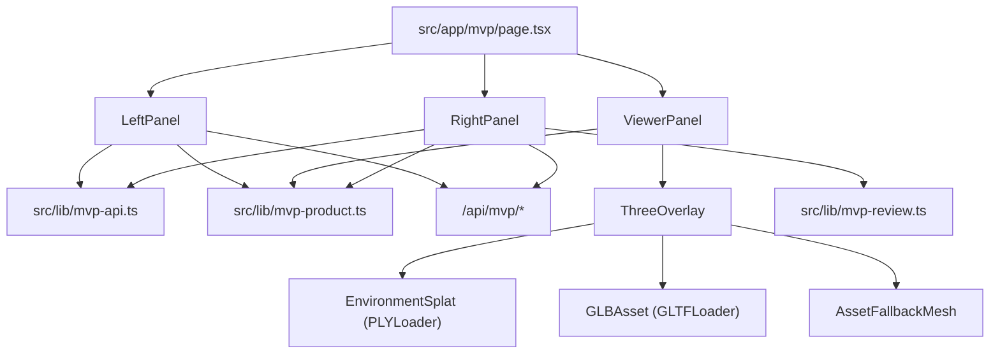
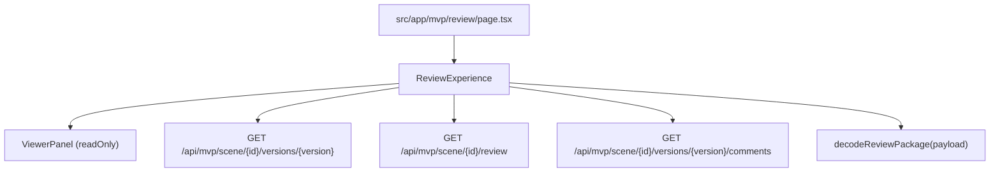

# Component Map

This is the current route and component structure of the app, with emphasis on what is actually wired into live routes.

## Route-Level Map

| Route | Entry File | Main Components | Notes |
| --- | --- | --- | --- |
| `/` | `src/app/page.tsx` | none | Immediate redirect to `/mvp` |
| `/mvp` | `src/app/mvp/page.tsx` | `LeftPanel`, `ViewerPanel`, `RightPanel` | Primary live product surface |
| `/mvp/review` | `src/app/mvp/review/page.tsx` | `ReviewExperience`, `ViewerPanel` | Read-only review shell |
| `/pro` | `src/app/pro/page.tsx` | `SceneViewer`, `ImageIngestionFlow`, `AssetOrchestrator`, `AgenticChat`, `TimelineEditor`, `DirectorControls` | Separate prototype surface |
| `/login` | `src/app/login/page.tsx` | `LoginForm`, `BackgroundNoise` | Auth entry |
| `/dashboard` | `src/app/dashboard/page.tsx` | page-local UI, `BackgroundNoise` | Cookie-gated dashboard shell |
| `/privacy`, `/terms` | page files under `src/app` | page-local content | Static/legal routes |

## MVP Editor Tree

### `src/app/mvp/page.tsx`

Owns top-level MVP state:

- `activeScene`
- `sceneGraph`
- `assetsList`
- save/autosave state
- version list

It does not talk directly to the backend for generation. Instead:

- `LeftPanel` owns upload/generation/capture interactions
- `RightPanel` owns save/review/comment interactions
- `ViewerPanel` owns scene display and transform manipulation

### `src/components/Editor/LeftPanel.tsx`

Responsibilities:

- backend capability check via `/api/mvp/setup/status`
- image upload via `/api/mvp/upload`
- preview generation via `/api/mvp/generate/environment`
- asset generation via `/api/mvp/generate/asset`
- capture session creation and update
- reconstruction start and job polling
- local asset tray population

This is the most backend-coupled frontend component in the repo.

### `src/components/Editor/ViewerPanel.tsx`

Responsibilities:

- current scene status banner
- drag/drop target for assets
- wrapper around `ThreeOverlay`

`ViewerPanel` is shared by:

- `/mvp`
- `/mvp/review`

That reuse is important: rendering changes here affect both editing and review.

### `src/components/Editor/ThreeOverlay.tsx`

Responsibilities:

- three.js canvas creation
- loading preview/reconstruction splats via `PLYLoader`
- loading asset meshes via `GLTFLoader`
- fallback box asset rendering
- orbit controls and transform editing through `PivotControls`

It is the rendering core of the MVP experience.

### `src/components/Editor/RightPanel.tsx`

Responsibilities:

- manual save trigger
- save state display
- environment readiness and quality display
- review link generation and export package
- review metadata and approval state
- version history and restore
- version-pinned comments
- scene graph inspection
- local asset tray to scene insertion

This is the persistence and review side of the MVP shell.

## Review Tree

### `src/components/Editor/ReviewExperience.tsx`

Responsibilities:

- decode inline review package from URL
- optionally hydrate the saved scene/version from backend
- reuse `ViewerPanel` in read-only mode
- show summary, review metadata, and comments

This route is low in component count but high in contract sensitivity because it depends on version, review, and comment payloads all matching editor expectations.

## Pro Workspace Tree

`/pro` is a separate prototype island.

Main coordinator:

- `src/app/pro/page.tsx`

Primary children:

- `src/components/Viewfinder/SceneViewer.tsx`
- `src/components/Viewfinder/ImageIngestionFlow.tsx`
- `src/components/Viewfinder/AssetOrchestrator.tsx`
- `src/components/Viewfinder/AgenticChat.tsx`
- `src/components/Viewfinder/DirectorControls.tsx`
- `src/components/Viewfinder/TimelineEditor.tsx`
- `src/components/Viewfinder/AnnotationSystem.tsx`
- `src/components/Viewfinder/AgentDirector.tsx`

Supporting mock APIs:

- `src/app/api/generate/route.ts`
- `src/app/api/agent/route.ts`
- `src/app/api/interrogate/route.ts`

Important separation:

- `/pro` does not depend on `/api/mvp/*`
- `/pro` does not depend on either Python backend

That makes it a good isolated workstream.

## Auth and App Shell Components

Active supporting components:

- `src/components/ui/LoginForm.tsx`
- `src/components/ui/BackgroundNoise.tsx`

They are used by:

- `/login`
- `/dashboard`

These files are coupled to auth/waitlist/server-action work, not to the MVP backend stack.

## Dormant or Unwired Trees

Based on current imports in `src/app`, these directories are not wired into active route entrypoints:

- `src/components/experience/*`
- `src/components/layout/*`

Related UI helpers appear mostly tied to that dormant tree:

- `src/components/ui/WaitlistForm.tsx`
- `src/components/ui/SuccessOverlay.tsx`
- `src/components/ui/GlitchText.tsx`
- `src/components/ui/EngineSimulation.tsx`
- `src/components/ui/WordFadeIn.tsx`
- `src/components/ui/FadeIn.tsx`

These are low-conflict areas for exploratory work, but they are also low-leverage unless the app intends to reactivate a marketing/experience route.

## Component Boundaries Best Suited For Parallel Work

- MVP editor rendering only: `ViewerPanel` and `ThreeOverlay`, if API shapes are frozen
- MVP persistence/review only: `RightPanel`, if scene/review/comment payloads are frozen
- Pro workspace: entire `Viewfinder` tree
- Auth/waitlist: login/dashboard/api-waitlist/server-actions/db
- Dormant experience tree: `components/experience`, `components/layout`, related UI helpers

## Components Most Likely To Cause Cross-Thread Collisions

- `LeftPanel`
- `RightPanel`
- `MVPPage`
- `ThreeOverlay`
- `ReviewExperience`

Those files sit directly on the current app’s runtime spine.
