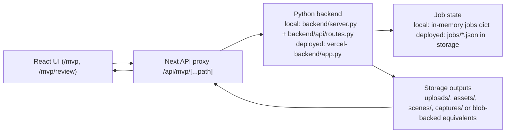

# Request Flow

This is the current request path for the MVP surface, from React UI through the Next proxy into the Python backend and finally into storage outputs.

## Canonical Spine

## Proxy Layer

All MVP network traffic crosses `src/app/api/mvp/[...path]/route.ts`.

What it does:

- resolves the backend target from `GAUSET_BACKEND_URL`, then `NEXT_PUBLIC_GAUSET_API_BASE_URL`, then `http://127.0.0.1:8000` in non-production local dev
- forwards the original method and body to the Python backend
- strips hop-by-hop request and response headers
- forwards `/storage/...` requests the same way as JSON API requests

Failure behavior:

- if no backend base URL is configured, the proxy returns a structured `503` for API calls and a plain `503` body for storage calls
- if the upstream backend cannot be reached, the proxy returns a structured `502` for API calls and a plain `502` body for storage calls

This file is the narrowest choke point in the MVP stack.

## 1. Capability Handshake

Used by `src/components/Editor/LeftPanel.tsx` on page load.

1. `LeftPanel` requests `GET /api/mvp/setup/status`.
2. `src/app/api/mvp/[...path]/route.ts` resolves the backend base URL and forwards the request unchanged.
3. Backend returns capability flags used to enable or disable preview, reconstruction, and asset controls.
4. `src/lib/mvp-product.ts` normalizes the payload into a common frontend shape.

Local response source:

- `backend/api/routes.py`

Deployed response source:

- `vercel-backend/app.py`

Important divergence:

- Local advertises reconstruction when the SHARP fusion worker is available.
- Vercel advertises preview and asset only; reconstruction is intentionally unavailable.

## 2. Upload -> Preview Environment

Triggered by `LeftPanel.handleUpload()` and `LeftPanel.generatePreview()`.

### Request path

1. Browser posts `multipart/form-data` to `POST /api/mvp/upload`.
2. Next proxy forwards to backend `POST /upload`.
3. Backend stores the uploaded image and returns an `image_id`.
4. Browser posts `POST /api/mvp/generate/environment` with `{ image_id }`.
5. Backend creates a `scene_*` job and starts generation.
6. Browser polls `GET /api/mvp/jobs/{job_id}` until `completed`.
7. Browser resolves the environment URLs and loads:
   - `/api/mvp/storage/scenes/{scene_id}/environment/splats.ply`
   - `/api/mvp/storage/scenes/{scene_id}/environment/cameras.json`
   - `/api/mvp/storage/scenes/{scene_id}/environment/metadata.json`
8. `ViewerPanel` / `ThreeOverlay` renders the PLY splat via `PLYLoader`.

### Storage outputs

Preview environment generation writes:

- `scenes/{scene_id}/environment/splats.ply`
- `scenes/{scene_id}/environment/cameras.json`
- `scenes/{scene_id}/environment/metadata.json`

### Implementation notes

- Local generation uses `backend/models/ml_sharp_wrapper.py`.
- Deployed generation uses the heuristic environment generator embedded in `vercel-backend/app.py`.
- `src/lib/mvp-api.ts::toProxyUrl()` rewrites all returned `/storage/...` URLs back through the Next proxy.

## 3. Upload -> Asset Generation

Triggered by `LeftPanel.generateAsset()`.

### Request path

1. Browser uploads an image to `POST /api/mvp/upload`.
2. Browser posts `POST /api/mvp/generate/asset` with `{ image_id }`.
3. Backend creates an `asset_*` job.
4. Browser polls `GET /api/mvp/jobs/{job_id}`.
5. When complete, frontend loads:
   - mesh URL
   - texture URL
   - preview image URL
6. `RightPanel` adds the asset to the local asset tray.
7. User can click or drag that asset into the live scene graph shown by `ViewerPanel`.

### Storage outputs

Asset generation writes:

- `assets/{asset_id}/mesh.glb`
- `assets/{asset_id}/texture.png`
- `assets/{asset_id}/preview.png`
- `assets/{asset_id}/metadata.json`

### Implementation notes

- Local asset generation uses `backend/models/triposr_wrapper.py`.
- Deployed asset generation uses the heuristic relief mesh generator in `vercel-backend/app.py`.
- Assets are not persisted into a scene until `/scene/save` is called.

## 4. Capture Set -> Reconstruction

Triggered by `LeftPanel.ensureCaptureSession()`, `addSelectedToCaptureSet()`, and `startReconstruction()`.

### Request path

1. Browser creates a session with `POST /api/mvp/capture/session`.
2. Browser adds uploaded image ids to the session with `POST /api/mvp/capture/session/{session_id}/frames`.
3. Backend persists a `capture_*` session payload.
4. Once the minimum capture count is reached, browser posts `POST /api/mvp/reconstruct/session/{session_id}`.
5. Browser polls `GET /api/mvp/jobs/{job_id}`.
6. On completion, frontend loads the environment files from `/storage/scenes/{scene_id}/environment/*`.

### Storage outputs

Capture flow writes:

- `captures/{session_id}.json`
- uploaded frames already stored in `uploads/images/*`

Local reconstruction also writes:

- `scenes/{scene_id}/environment/splats.ply`
- `scenes/{scene_id}/environment/cameras.json`
- `scenes/{scene_id}/environment/metadata.json`

### Implementation notes

- Local reconstruction uses `backend/models/sharp_fusion_reconstructor.py`, which runs per-view single-image environments and fuses them into one scene.
- Deployed Vercel reconstruction stops at capture collection and returns `501` for reconstruction start.

## 5. Scene Save, Versions, Review, Comments

This is the persistence path driven mainly by `src/app/mvp/page.tsx` and `src/components/Editor/RightPanel.tsx`.

### Scene save

1. `MVPPage.saveScene()` posts `POST /api/mvp/scene/save`.
2. Backend writes the current scene graph.
3. Backend also writes a version payload with a generated `version_id`.
4. Frontend refreshes version history.

Scene persistence outputs:

- `scenes/{scene_id}/scene.json`
- `scenes/{scene_id}/versions/{version_id}.json`
- deployed only: `scenes/{scene_id}/versions_index.json`

### Review metadata

1. `RightPanel` loads `GET /api/mvp/scene/{scene_id}/review`.
2. `RightPanel.saveReview()` posts `POST /api/mvp/scene/{scene_id}/review`.
3. Backend writes:
   - `scenes/{scene_id}/review.json`

### Version comments

1. `RightPanel` loads `GET /api/mvp/scene/{scene_id}/versions/{version_id}/comments`.
2. `RightPanel.submitComment()` posts `POST /api/mvp/scene/{scene_id}/versions/{version_id}/comments`.
3. Backend writes:
   - `scenes/{scene_id}/comments/{version_id}.json`

## 6. Review Page Hydration

Used by `/mvp/review` and `src/components/Editor/ReviewExperience.tsx`.

There are two ways the review page gets data:

- Inline package path:
  - `RightPanel` builds a base64 payload with `src/lib/mvp-review.ts`.
  - `/mvp/review?payload=...` decodes the scene locally in the browser.
- Saved scene path:
  - `/mvp/review?scene={scene_id}&version={version_id}`
  - browser fetches:
    - `GET /api/mvp/scene/{scene_id}/versions/{version_id}`
    - `GET /api/mvp/scene/{scene_id}/review`
    - `GET /api/mvp/scene/{scene_id}/versions/{version_id}/comments`

`ReviewExperience` reuses `ViewerPanel` in `readOnly` mode, so the review surface shares the same environment and asset rendering code as the editor.

## 7. Storage Contract

The UI expects these path families to remain stable:

- `/storage/uploads/images/{filename}`
- `/storage/assets/{asset_id}/mesh.glb`
- `/storage/assets/{asset_id}/texture.png`
- `/storage/assets/{asset_id}/preview.png`
- `/storage/scenes/{scene_id}/environment/splats.ply`
- `/storage/scenes/{scene_id}/environment/cameras.json`
- `/storage/scenes/{scene_id}/environment/metadata.json`
- `/storage/scenes/{scene_id}/scene.json`

Local storage serving:

- `backend/server.py` mounts `/storage/uploads`, `/storage/assets`, and `/storage/scenes` directly from repo folders.

Deployed storage serving:

- `vercel-backend/app.py` exposes `/storage/{storage_path:path}` and either:
  - redirects to the public blob URL, or
  - streams bytes from the configured storage backend.

## 8. Hot-Path Contract Risks

These are the main places where parallel work will collide.

- `src/app/api/mvp/[...path]/route.ts` is the single transport bridge. Path changes here affect every MVP request.
- `backend/api/routes.py` and `vercel-backend/app.py` duplicate nearly the same API surface but do not behave identically.
- `src/lib/mvp-product.ts` is the frontend normalizer for setup and metadata payloads.
- `/scene/save`, `/scene/*/versions`, `/scene/*/review`, and `/scene/*/comments` are used by editor UI, review UI, tests, and smoke scripts.

## 9. Known Local vs Deployed Divergences

These should be treated as deliberate but fragile differences.

- Local upload returns frame analysis; deployed upload currently returns no analysis payload.
- Local generation uses background tasks plus an in-memory jobs dict; deployed generation usually finishes inline, then writes a completed job JSON record.
- Local reconstruction is real when the worker is installed; deployed reconstruction is collection-only and returns `501`.
- Local version listing scans `scenes/{scene_id}/versions/*.json`; deployed listing depends on `versions_index.json`.
- Local `/scene/save` writes the full incoming `scene_graph`; deployed `/scene/save` normalizes and keeps only `environment` and `assets`.

Those divergences are the highest-risk area for any cross-backend contract change.

## 10. Restart-Baseline Shared Contracts

The freeze baseline runtime still uses the current upload/capture/save/review flows above. Restarted runtime lanes should now converge on three explicit shared contracts:

1. `WorldIngestRecord` after every source enters the product
2. `review_package.inline.scene_document_first.v1` for inline review/share/export payloads
3. `DownstreamHandoffManifest` for Unreal and later named downstream targets

### Source Normalization Map

| Current or planned source path | Shared `source_kind` | Required normalized output |
| --- | --- | --- |
| Demo world open | `demo_world` | ingest record that preserves demo/reference truth |
| Upload still -> preview or asset | `upload_still` | ingest record with upload provenance and lane truth |
| Provider still -> upload tray -> preview or asset | `provider_generated_still` | ingest record with provider, model, prompt, and generation job provenance |
| Capture session -> reconstruction | `capture_session` | ingest record with capture evidence, reconstruction truth, and blockers if incomplete |
| Saved scene reopen | `saved_scene_reopen` | ingest record that reuses the durable `scene_id` and prior provenance |
| External package import | `external_world_package` | ingest record seeded from package manifest and file inventory |
| Third-party world-model import | `third_party_world_model_output` | ingest record seeded from producer metadata, artifact inventory, and conversion requirements |

### Shared Contract Consequences

- No future intake path should open straight into editor-only state without first resolving through the ingest contract.
- Review/export payloads should move from ad hoc `sceneGraph` packages toward the scene-document-first package documented in `contracts/schemas/review-package.inline.scene-document-first.json`.
- Downstream delivery should move from generic "Scene package exported" language toward named handoff manifests with explicit `ready` or `blocked` state.
- Preview worlds may still export review context, but they must remain blocked for Unreal or other downstream-ready claims.
